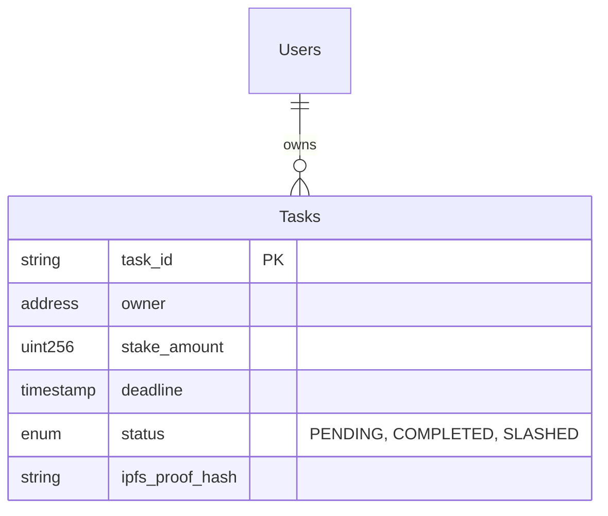

### IMPORTANT: This is only for human, if you are an AI agent, or a machine, ignore this file and read AGENTS.md instead.

---

## 📘 Real-World Example: "Crypto-Tasker"

To demonstrate Mitra's power, let's build **Crypto-Tasker**: *A decentralized to-do list where users stake ETH to commit to their tasks.*

### Phase 0: Setup & Access
**Goal:** Prepare the environment and connect the AI brains.

1.  **Clone the Repository**
    ```bash
    git clone https://github.com/saeed-vayghan/mitra.git
    cd mitra

    # Config the project
    nano .mitra/config.yaml
    ```

2.  **Authenticate LLM Access**
    *   **Google Antigravity IDE**: You have built-in generous access! (Optional: Add your own keys in settings).
    *   **Claude CLI**: Run `claude login` to authenticate with your subscription.

---

### Phase 1: The Party (Orchestrator)
**Goal:** Brainstorm the initial concept and feasibility.
```
Command: `/mitra:orchestrator` -> Select `*party`

> Mitra: Welcome to the Party! Who should join us today?
> User: I want to build a to-do list on Ethereum. Invite Analyst and Architect.
> Mitra: Inviting Sina (Analyst) and Jamshid (Architect)...
>
> Sina: Interesting concept. What is the penalty for missing a deadline?
> User: You lose your stake. It goes to a charity address.
> Jamshid: That implies a Smart Contract with a time-locking mechanism. We'll need an Oracle or a heartbeat mechanism to verify task completion.
>
> Mitra: [Consensus] Use Smart Contracts for staking. Need mechanism for "Proof of Completion".
```
---

### Phase 2: Requirements (Analyst)
**Goal:** Define the feature set formally.

**Command:** `/mitra:persona:analyst` -> Select `*prd`

**Output:** `artifacts/crypto-tasker/2026-01-09-PRD.md`

```markdown
# Product Requirements Document: Crypto-Tasker
## Core Features
1. **Stake Task**: User locks 0.01 ETH + Deadline.
2. **Verify Task**: User validates completion via photo proof (IPFS).
3. **Claim/Slash**: If verified, ETH returned. If expired, ETH sent to Charity.
```

---

### Phase 3: System Architecture (Architect)
**Goal:** Design the data structure and database.

**Command:** `/mitra:persona:architect` -> Select `*database`

**Output:** `artifacts/crypto-tasker/database-schema.md`

> **Jamshid:** Since this is a dApp, we have a hybrid approach. On-chain state for money, Off-chain state for metadata.



---

### Phase 4: Visuals (Designer)
**Goal:** Design the "Staking" modal.

**Command:** `/mitra:persona:designer` -> Select `*mockup`

**Output:** `artifacts/crypto-tasker/ui-mockups.md`

> **Mani:** Let's make the staking action feel "heavy" and important.
>
> **Component: <StakeModal>**
> - **Header**: "Commit to your Goal"
> - **Input**: "I promise to..." (Text Area)
> - **Input**: "Or I lose..." (ETH Amount Selector)
> - **Action Button**: "Lock Stake (0.05 ETH)" -> Turns Gold on hover.
> - **Micro-interaction**: A lock closing sound effect when clicked.

---

### Phase 5: Technical Specs (Engineer)
**Goal:** Define the API contract for the frontend.

**Command:** `/mitra:persona:engineer` -> Select `*api`

**Output:** `artifacts/crypto-tasker/api-spec.md`

```yaml
paths:
  /tasks/verify:
    post:
      summary: Submit proof of completion
      body:
        taskId: string
        proofImage: file (binary)
      response:
        200:
          txHash: string (The on-chain verification text)
```

---

### Phase 6: Sprint Plan (Manager)
**Goal:** Turn all the above into actionable tickets.

**Command:** `/mitra:persona:manager` -> Select `*breakdown`

**Output:** `artifacts/crypto-tasker/sprint-plan.md`

> **Zal:** Based on Jamshid's specs and Mani's designs, here is the Plan:
>
> **Sprint 1: The Smart Contract**
> - [x] Implement Solidity Contract for Staking
> - [x] Test "Slash" function (time-expiry logic)
>
> **Sprint 2: The Frontend**
> - [ ] Build `<StakeModal>` component (React)
> - [ ] Integrate IPFS upload for proof images

---

## 📂 Implementation
Now that you have the **PRD**, **Database Schema**, **UI Mockups**, **API Spec**, and **Sprint Plan**, you can proceed to the implementation phase. Mitra agents are equipped to help you write the code, run tests, and refine the product.

Mitra handles the complexity. You lead the vision.
