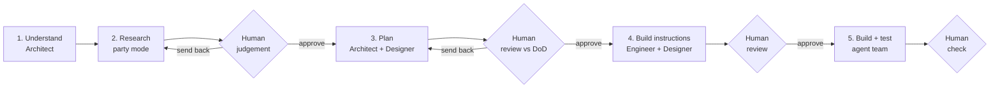

# CasaMarket Anomaly Hunt: Yuno Take-Home

This repo contains my solution to Yuno's data engineering challenge, **"Cross-Border Anomaly Hunt: CasaMarket's Silent 18% Revenue Drain"**.

It also shows **how** it was built: a team of AI agents running on the **Mitra** framework, with **me (the human) in the middle** of every step.

---

## 1. The Problem in 30 Seconds

- **CasaMarket** is an online home-goods store in Mexico, Colombia, Argentina and Chile. It handles about 45k payments a month across several payment processors (PSPs).
- **18%** of its approved payments **settle** for a different amount than was **authorized**.
- This cost about **$127,000** last quarter, and nobody knows why.
- **The ask:** generate realistic test data, build a pipeline that measures the gaps, find the root causes, and (stretch goals) add monitoring and recommendations.

The full brief is in [scenario.md](artifacts/yuno/architect/00-scenario/scenario.md).

---

## 2. The Solution

The working code is in **[casamarket-recon/](casamarket-recon/)**. It is a small, local analytics tool called `recon`.

```
synthetic data  ->  dbt + DuckDB pipeline  ->  analysis + alerts + reports  ->  CLI and Streamlit dashboard
```

| Part | What it does | Tools |
|---|---|---|
| **Data generator** | Seeded, config-driven fake data (135k rows by default, or 500 for a quick smoke run) with planted patterns and truth labels | Python |
| **Pipeline** | raw → staging → intermediate → marts; one enriched row per transaction; exact money math in minor units | dbt-core + DuckDB |
| **Detection** | Takes out the expected FX move, then sorts every gap into `exact` / `rounding` / `fx_tolerance` / `meaningful` / `large` | dbt + YAML thresholds |
| **Root-cause analysis** | Rates with confidence intervals, chi² with multiple-test correction (BH-FDR), one logistic GLM, cause labels checked against the truth labels, and $ impact | scipy, statsmodels |
| **Monitoring** | 5-page dashboard and 6 YAML alert rules | Streamlit + Plotly |
| **CLI** | `recon generate / build / validate / analyze / alerts / report / query / worst-week / dashboard / all` | Typer |
| **Reports** | `FINDINGS.md` and `RECOMMENDATIONS.md` (3–5 actions); every number comes from the data | Markdown + figures |

**Planted patterns the analysis must find:**
- **P1:** PSP_B has a worse rate in Argentina.
- **P2:** Colombian orders over $300 settle late.
- **P3:** Weekend authorizations have more gaps.
- **P4:** PSP_D rounds cross-border CLP/COP settlements down to 1,000.
- **Others:** FX timing, partial captures, fees, tax, fraud holds, PSP adjustments, and a fee drift in month 3.

### Quick start

```bash
cd casamarket-recon
uv sync          # set up Python 3.12 from the lock file
make smoke       # fast run on 500 rows
make all         # full run (135k rows)
make app         # dashboard at http://localhost:8501
```

Other ways to run it: `uv run recon all`, or `docker compose up`.
See [casamarket-recon/README.md](casamarket-recon/README.md) for details.

---

## 3. How the Work Was Done: Mitra Agents + Human in the Middle

### What is Mitra?

Mitra is a multi-agent framework. Each agent has a clear role, its own instructions, and its own output folder. All agents share one memory system, so work can be saved and picked up later.

| Agent | Role | What it did in this project |
|---|---|---|
| 🎼 **Mitra** | Orchestrator | Ran group sessions, research, reviews and the timeline |
| 🏛️ **Jamshid** | Architect | Scenario, playbook, implementation plan, system design diagrams |
| ⚡ **Kaveh** | Engineer | Technical specs and build instructions for infra, pipeline and backend |
| 🎨 **Mani** | Designer | UI/UX plan and build instructions for the dashboard |
| 📊 **Sina** | Analyst | Available for requirements work |
| 👑 **Zal** | Manager | Available for planning and task breakdown |

Mitra's setup and guide: [.mitra/docs/GUIDE.md](.mitra/docs/GUIDE.md). The agent definitions are in [.agents/workflows/](.agents/workflows/).

### The human's role (the important part)

The agents do the heavy work, but **I steer, check and decide at every gate**. No stage moved forward without my review.

| I do | The agents do |
|---|---|
| Set the goal and the scope | Research options and write drafts |
| Choose which agents work together, and when | Discuss and challenge each other in group sessions |
| Make the final call on key decisions (stack, thresholds, trade-offs) | Propose choices with pros and cons |
| Run judgement and review rounds; send work back when it is not good enough | Fix what the review found |
| Check work against the brief's goals and Definitions of Done | Map every requirement to a deliverable |
| Keep the timeline of what happened | Write code and tests from the approved instructions |

### The workflow



| Step | What happened | Human gate | Output |
|---|---|---|---|
| **1. Understand** | The Architect read the brief and wrote the scenario and a playbook | I checked it matched the brief | [scenario.md](artifacts/yuno/architect/00-scenario/scenario.md), [PLAYBOOK.md](artifacts/yuno/architect/01-playbook/PLAYBOOK.md) |
| **2. Research** | *Party mode*: the Architect and Engineer worked together to pull out requirements and compare options (3 versions) | Judgement session on the ADR and requirements, then a quality round on the decisions | [01-research/](artifacts/yuno/orchestrator/01-research/), [FINAL-SOLUTION.md](artifacts/yuno/orchestrator/01-research/FINAL-SOLUTION.md) |
| **3. Plan** | Backend/infra plan and UI/UX plan, plus system design diagrams | Plans judged against the scenario goals and DoDs | [IMPLEMENTATION-PLAN.md](artifacts/yuno/architect/02-implementation-plan/IMPLEMENTATION-PLAN.md), [UI-UX-PLAN.md](artifacts/yuno/designer/01-ui-ux/UI-UX-PLAN.md), [03-system-design/](artifacts/yuno/architect/03-system-design/), [DELIVERABLES-CHECK.md](artifacts/yuno/orchestrator/04-plan-review/DELIVERABLES-CHECK.md) |
| **4. Instructions** | Step-by-step build guides for each owner | Instructions reviewed before any code was written | [engineer/02-develop-instruction/](artifacts/yuno/engineer/02-develop-instruction/), [designer/02-develop-instruction/](artifacts/yuno/designer/02-develop-instruction/), [JUDGMENT.md](artifacts/yuno/orchestrator/05-dev-instruction-review/JUDGMENT.md) |
| **5. Build** | The agent team wrote code and tests in milestones M1 → M2 → M3 | I check each milestone | [casamarket-recon/](casamarket-recon/) |

### How the agents work together without conflicts

- **Clear ownership:** each file has one owner (INFRA, BACKEND or FRONTEND). See [OWNERSHIP.md](casamarket-recon/OWNERSHIP.md).
- **Hand-off file:** if an agent needs a change in someone else's file, it asks in [HANDOFF.md](casamarket-recon/HANDOFF.md) instead of editing it.
- **One shared contract:** names, arguments and columns are fixed in one place, so the dashboard and the CLI read the same data.
- **Milestones:** a thin end-to-end version first (M1), then analysis and reports (M2), then alerts and polish (M3).

### Time split

About **half** of the 2-hour budget went to **understanding, planning and review**, and the other half to **building and testing**.
In real work, more time on planning often pays off: it catches corner cases early and leads to a solid, maintainable, scalable and secure delivery.

The full step-by-step log is in the append-only [timeline](artifacts/yuno/orchestrator/02-timeline/02-timeline.md).

---

## 4. Repo Map

```
.
├── README.md                     # this file
├── casamarket-recon/             # the solution: code, dbt, tests, reports, dashboard
├── artifacts/yuno/               # everything the agents produced, by agent
│   ├── architect/                # scenario, playbook, implementation plan, system design, best practices
│   ├── designer/                 # UI/UX plan and dashboard build instructions
│   ├── engineer/                 # backend/infra build instructions
│   └── orchestrator/             # research, reviews, judgements, timeline
├── .mitra/                       # Mitra framework: agents, docs, templates
├── .agents/                      # agent workflows (source of truth), rules, skills
└── .claude/                      # Claude CLI commands that mirror the agents
```

---

## 5. Scale Path (documented, not built)

The brief asks for a simple local tool, so the AWS version is designed but not built:
S3 + Iceberg → Airflow → dbt on StarRocks → BI on StarRocks, with Flink for streaming events.
See [10-aws-solution.svg](artifacts/yuno/architect/03-system-design/10-aws-solution.svg) and section 11 of the [playbook](artifacts/yuno/architect/01-playbook/PLAYBOOK.md).
