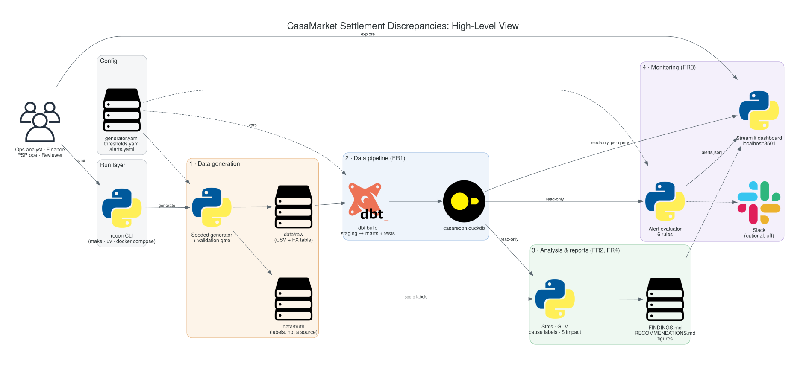

# CasaMarket settlement reconciliation (`recon`)

Finds, explains and monitors gaps between **authorized** and **settled** amounts across 5 PSPs,
4 countries (MX, CO, AR, CL) and 4 currencies.

## Problem
CasaMarket processes about 45k transactions a month. The CFO sees 18% of approved payments settle for a
different amount, costing about $127k last quarter, with no known cause. This repo builds the data
pipeline, the root-cause analysis and a monitor (CLI, alerts, dashboard) for that problem.

## Quick start
Prerequisites: Python 3.12 + [uv](https://docs.astral.sh/uv/) (or only Docker for path 3).
```bash
# 1) with make
make all            # generate -> build -> validate -> analyze -> alerts -> report  (~15 s)
make app            # dashboard on http://localhost:8501
# 2) without make
pip install uv && uv run recon all
# 3) without Python
docker compose up   # runs `recon all`, then serves http://localhost:8501
# brief questions
uv run recon worst-week --month last
uv run recon query --min-usd 50 --format csv > over_50.csv
```
Other commands: `uv run recon --help` · `make smoke` (500 rows, ~5 s) · `make test` · `make check-idempotent`.

| Exit code | Meaning |
|---|---|
| 0 | ok |
| 1 | error, e.g. no DB yet ("Run `make all` first") or a step not built |
| 2 | bad usage / unknown filter value |
| 5 | data quality: a dbt test or the validation gate failed (the last good DB is kept) |

## What it does
| Step | Command | Output |
|---|---|---|
| Synthetic data (seed 42, 135k rows, Apr–Jun 2026, planted patterns) | `recon generate` | `data/raw/*.csv`, `data/truth/labels.parquet` |
| dbt on DuckDB: FX-adjusted residual, category, likely cause per transaction | `recon build` | `data/casarecon.duckdb` |
| Validation gate (brief ranges + planted patterns) | `recon validate` | `reports/run_manifest.json` |
| Statistics: segment rates, peer tests (BH q), GLM, truth check, $ impact | `recon analyze` | `reports/findings.json`, `reports/analysis/*.csv`, `reports/figures/` |
| 6 alert rules on the last closed week | `recon alerts` | `reports/alerts.jsonl`, `reports/alerts.md` |
| Findings and ranked actions | `recon report` | `reports/FINDINGS.md`, `reports/RECOMMENDATIONS.md` |
| Read-only CLI + Streamlit dashboard on one core API | `recon query`, `recon worst-week`, `make app` | terminal / :8501 |

## Answering the brief's questions
| Question | CLI | Dashboard |
|---|---|---|
| Which PSP had the worst week last month? | `uv run recon worst-week --month last [--format json]` | Overview → worst-week card |
| Show all transactions with discrepancies over $50 | `uv run recon query --min-usd 50 [--psp PSP_B] [--country AR] --format csv` | Outliers page (opens at "over $50") |

The CLI and the dashboard call the same functions in `casarecon.core`, so they return the same numbers.

## Key findings and recommendations
Generated from the data, not typed by hand:
- [`reports/FINDINGS.md`](reports/FINDINGS.md): summary, cause Pareto, worst week, each finding with n, CI, lift, q-value and $.
- [`reports/RECOMMENDATIONS.md`](reports/RECOMMENDATIONS.md): 3–5 ranked actions with $ per quarter, owner and implementation.
- [`reports/alerts.md`](reports/alerts.md): alerts for the last closed week.

## Architecture


- **Layers:** raw CSV → dbt `staging` → `intermediate` (all joins) → `marts` (`fct_transaction_discrepancy`, one row per
  transaction, plus 4 small marts). Details: [docs/03-data-pipeline.svg](docs/03-data-pipeline.svg), [dbt/README.md](dbt/README.md).
- **Why DuckDB + dbt:** one local file with no server; SQL models with tests (unit, generic, singular) that stop a bad build;
  the same models port to a warehouse (see the AWS scale path below).
- **One core API:** CLI, analysis, alerts and dashboard read through `casarecon.core` (read-only, parameterized SQL,
  masked customer IDs). `recon build` is the only writer: it builds into a temp file and swaps it in atomically.
  See [docs/06-cli-and-dashboard.svg](docs/06-cli-and-dashboard.svg) and `OWNERSHIP.md` for the code layout.

## Definitions
- **Money:** local currency, integer minor units (CLP has 0 decimals). USD values use the auth-day FX rate, 2 dp.
- **Expected settled:** `auth × fx_settle / fx_auth` for cross-border rows (removes the FX move), else `auth`.
  **Residual** = settled − expected. `residual_pct` is in percent.

| Category (first match wins) | Rule |
|---|---|
| `exact` | settled = authorized |
| `rounding` | \|settled − authorized\| ≤ 1 minor unit |
| `fx_tolerance` | \|residual\| ≤ 2% and < $20 |
| `meaningful` (flagged) | 2–5% and < $20 |
| `large` (flagged) | > 5% or ≥ $20 |

Likely causes (no PSP names in the rules): `fx_timing, psp_rounding, partial_capture, psp_fee, tax_recalc, fraud_hold,
psp_adjustment, tip, unexplained`. Cut-offs live in `config/thresholds.yaml`.

### Assumptions
- Data is synthetic and follows the brief's ranges: about 14% flagged and 33% non-exact. The generator is calibrated so the quarter's net loss lands near the CFO's ~$127k (`large_size_bias` in `config/generator.yaml`); the CFO's 18% flag rate is not reproduced. Both are compared as estimates.
- Both amounts are in the merchant's local currency, in integer minor units (CLP 0 decimals).
- Cross-border = `payer_currency = USD`. Expected settled removes the auth→settle FX move; USD uses the auth-day rate.
- "Meaningful" = |residual| > 2% or ≥ $20. Cut-offs are in `config/thresholds.yaml`; FINDINGS shows sensitivity at 1/2/3%.
- "Over $50" = FX-adjusted residual in USD, strictly > 50.
- Times are merchant local time. Weekend = Sat/Sun local.
- A week is ISO (Mon–Sun, by auth date) and belongs to the month of its Thursday. "Last month" = last full calendar month in the data. As-of = the latest timestamp in the data, never the wall clock.
- Worst week = highest net USD loss (under − over) per PSP × week. Weeks with < 30 settled rows rank last ("low sample").
- Alerts use the last closed week (its Sunday ≤ as-of − 7 days), so late settlements are counted.
- No tips in the data (home goods); the `tip` cause is reported as "ruled out".
- $ impact and savings are estimates. Saving = excess loss × a stated reduction %.
- Tool versions: duckdb 1.4.x, dbt-core 1.12.x, dbt-duckdb 1.11.x (exact versions in `reports/run_manifest.json`).

## How to read the outputs
- **Flag rate** = (`meaningful` + `large`) / settled rows. **CI** = Wilson 95% interval.
- **Peer** = other PSPs in the same country. **Lift** = rate / peer rate.
- **q** = Benjamini-Hochberg adjusted p-value over every test in the run; a finding counts when q < 0.05.
- **Gross under** = money CasaMarket did not receive. **Gross over** = money received above expected. **Net** = under − over (positive = loss).
- **Excess loss** = (rate − peer rate) × n × mean loss: the $ above what peers would lose on the same volume.
- A "discrepancy" is always measured **after** the FX move is removed. A cross-border row with only an FX move is `fx_tolerance` / `fx_timing`, not a loss.

## Data and validation
- **Generator:** `recon generate` (seed 42, `config/generator.yaml`) plants patterns:
  - P1: PSP_B in AR.
  - P2: CO orders over $300 settle slowly.
  - P3: weekends.
  - P4: PSP_D rounds CLP/COP.
  - X1–X6: the causes.
  - A PSP_C fee drift in June.
  - Truth labels go to `data/truth/` and are never read by dbt.
- **Committed sample:** 500 rows in `data/sample/`.
- **dbt tests:** contracts on staging and the fact table, generic tests, singular tests, and unit tests with hand-worked rows (FX row, CLP, "2¢ on $500", the $20 boundary, one row per cause). Any failure → exit 5, and the last good DB is kept.
- **Validation gate (`recon validate`):** brief spec checks and bucket shares (brief range ± 3 SE) are always hard. P1–P4 bands are hard on a full run and warnings on a smoke run. The result goes to `reports/run_manifest.json`.
- **Idempotent:** `make check-idempotent` runs `make all` twice and compares hashes of the raw CSV and every report file.

## Alerts
`recon alerts` checks 6 rules from `config/alerts.yaml` on the last closed week. Each alert says whether it is NEW, ONGOING or RESOLVED compared with the week before.

| Rule | Fires when | Owner |
|---|---|---|
| `peer` | a PSP × country flags more than its peers (q < 0.05, gap ≥ 2 pts) | PSP ops |
| `change` | a segment's rate jumps > 3σ vs its last 8 weeks | PSP ops |
| `money_leak` | under-settled USD share of settled USD passes 1.5% (SEV3) / 2.0% (SEV2) | Finance |
| `large_rows` | `large` rows in the week (top 3 listed) | PSP ops |
| `pending_aging` | > 10% (SEV3) / 25% (SEV2) of pending rows older than 7 days | PSP ops + Finance |
| `settle_lag` | late settlements (> 7 d) above 6% in a country × tier | PSP ops |

If one PSP fires `peer` in 3+ countries, the rows collapse into one PSP-wide alert (`PSP_C|ALL`).
Alert memory: every run appends to `data/alerts/history.jsonl` (gives `open_since`); `recon alert
list | ack | mute | unmute | history` manage `config/alert_state.yaml`. What would be sent (after mute
and dedupe) goes to the local outbox `reports/notifications.jsonl`.

Segments with fewer than 50 rows give `INSUFFICIENT_DATA`, not an alert. Slack is off unless `slack.enabled: true`
and `SLACK_WEBHOOK_URL` is set. Design: [docs/05-alert-system.svg](docs/05-alert-system.svg).

## Monitoring
Run `make app` and open http://localhost:8501 (or `docker compose up`).

| Page | Answers |
|---|---|
| Overview | KPIs for the last closed week, trend, week-over-week, **worst PSP week last month** |
| Drill-down | Rates by country, PSP, size, weekday, cross-border, lag, with 95% ranges; CSV |
| Outliers | **Transactions with a discrepancy over $50**, why each is flagged; CSV |
| Root causes & actions | Loss by cause, findings (n, rate, CI, peer, lift, q, $), PSP × country heatmap, recommendations |
| Alerts | Alerts for the last closed week (6 rules), status and severity, link to the segment |

Full guide, including the alert rules in plain English: [docs/MONITORING.md](docs/MONITORING.md).

## Scale path on AWS
Documented, not built. See [docs/10-aws-solution.svg](docs/10-aws-solution.svg).

| Local | AWS / Yuno stack |
|---|---|
| CSV in `data/raw` | PSP settlement files → S3 + Iceberg |
| DuckDB file | StarRocks (marts) |
| dbt-duckdb | dbt on StarRocks (same models, macros for dialect) |
| `make all` | Airflow (MWAA) daily DAG (Cosmos) |
| batch export | MSK + Flink for auth/settlement events |
| `recon alerts` | same evaluator as an Airflow task → SNS → Slack/PagerDuty, with alert state |
| Streamlit | Superset on StarRocks, SSO |
| synthetic FX | real daily FX feed |

## Limitations and next steps
- **Synthetic data:** the causes were planted, so the truth check measures the rules against the generator, not the real world.
- **Single node:** default is a full rebuild each run; `recon build --incremental` exists (restatement window, see below) but gains little at 135k rows.
- **Local lake only:** per-PSP files, quarantine and staged parquet live under `data/lake/` (no cloud storage).
- **Next steps:**
  - Real PSP settlement files through `recon ingest` (formats in `config/ingest.yaml`).
  - The real daily FX feed.
  - Real per-PSP fee contracts in the dated `psp_fees` seed.
  - Order events, to confirm partial captures.
  - CI on every push (`.github/workflows/ci.yml`).

## Local dev tools
See [docs/PLATFORM.md](docs/PLATFORM.md) and [docs/ARCH-M4.md](docs/ARCH-M4.md). All local; nothing is deployed.

| Command | What it does |
|---|---|
| `make lake` | land per-PSP daily files → contract check (bad files → `data/lake/quarantine/`) → staged parquet → DQ check → `CASARECON_SOURCE=lake` build |
| `recon ingest land / load [--from --to] / check` | the lake steps one by one; DQ result in `reports/ingest_dq.json` (freshness, volume, schema drift) |
| `recon build --incremental [--lookback-days 15]` | rebuild only rows inside the restatement window; weeks inside it are `is_provisional` |
| `recon ops backfill --from D --to D` | replay days: reload landing files + incremental build |
| `recon ops pii-scan` | fail (exit 5) if a banned field or a full customer ID appears in outputs |
| `recon ops lineage` | dbt docs + `reports/lineage/LINEAGE.md` (models → sources) |
| `make dev-check` | pii-scan + lineage |

Reference data is dated (`valid_from` / `valid_to` in the fee and VAT seeds), and every table carries `merchant_id`.
Metric definitions live once in `core/metrics.py`.

## Development
- **Layout:** see `OWNERSHIP.md`. Each major folder has a short README.
- **Tests:** `make test` runs pytest on a 500-row fixture DB built in a temp dir; tests never touch `data/`.
- **AI-assisted workflow:** AI agents wrote the code from a written spec. It was checked by the dbt unit tests (hand-worked rows), the truth check against generator labels, the validation gate, pytest, and the idempotency check.
