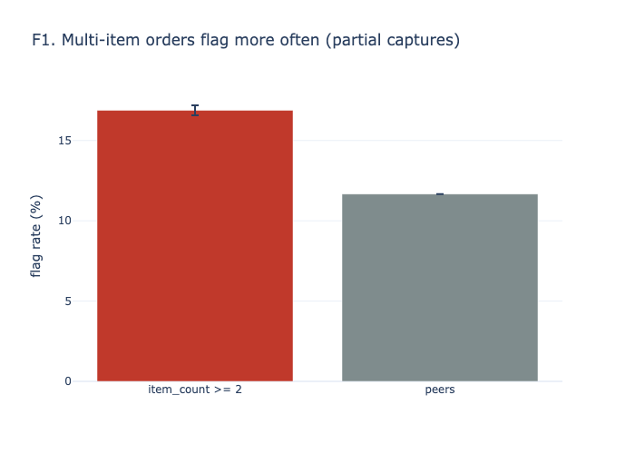
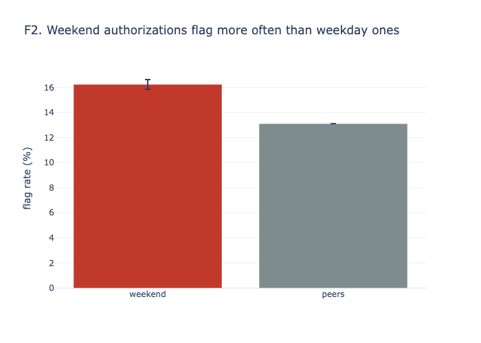
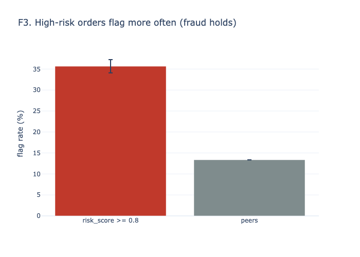
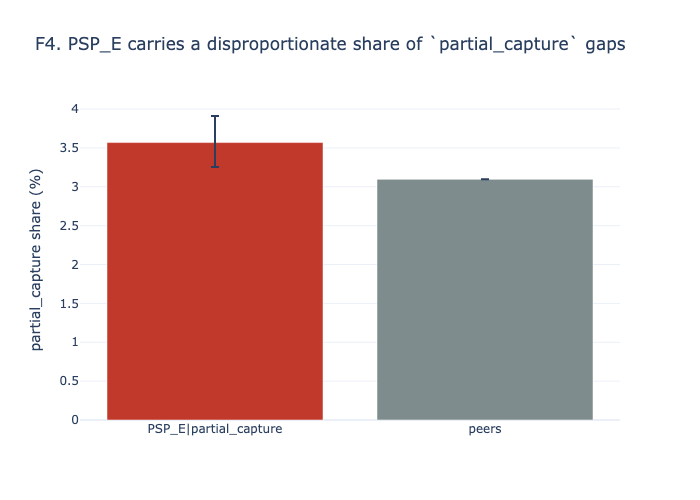
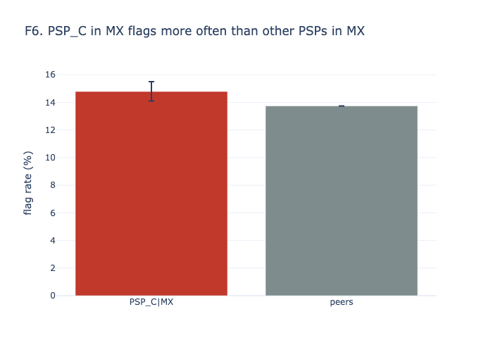
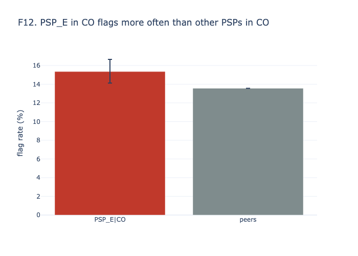

# Settlement discrepancy findings

_As of 2026-06-30T23:58:00 · data window 2026-04 to 2026-06 (3 months) · every number below is generated by `recon report` from `reports/findings.json` and `reports/analysis/*.csv`._

## Summary

- **Settled payments:** 124,389. **Flagged** (meaningful or large): 17,415 (14.0%); any non-exact gap: 32.9%. Synthetic data follows the brief's ranges; it does not claim to reproduce the CFO's figure.
- **Money:** gross under-settled $234,589, gross over-settled $319, net loss $234,270 for the quarter, compared with $127k (estimate; synthetic data).
- **Worst PSP week last month:** PSP_A, 2026-W23: net loss $5,056 on 3,003 payments (13.9% flagged).
- **Top findings:**
  - F1. Multi-item orders flag more often (partial captures): $58,875 per quarter.
  - F2. Weekend authorizations flag more often than weekday ones: $15,387 per quarter.
  - F3. High-risk orders flag more often (fraud holds): $13,004 per quarter.

**Where the money goes (cause Pareto)**

| likely_cause | n | gross_under_usd | gross_over_usd | net_usd | share_of_loss |
|---|---|---|---|---|---|
| partial_capture | 3,909 | $171,110 | $0 | $171,110 | 72.9% |
| psp_adjustment | 12,260 | $46,190 | $0 | $46,190 | 19.7% |
| fraud_hold | 884 | $15,128 | $0 | $15,128 | 6.4% |
| psp_fee | 941 | $1,450 | $0 | $1,450 | 0.6% |
| psp_rounding | 2,900 | $419 | $0 | $419 | 0.2% |
| tax_recalc | 554 | $291 | $319 | -$28 | 0.1% |
| fx_timing | 19,527 | $0 | $0 | $0 | 0.0% |
| tip | 0 | $0 | $0 | $0 | 0.0% |
| unexplained | 0 | $0 | $0 | $0 | 0.0% |

## Findings

**F1. Multi-item orders flag more often (partial captures).** 16.9% flag rate on item_count >= 2 (n = 55,702, 95% CI [16.6–17.2%]) vs 11.7% for peers — lift 1.45×, q < 0.001. $ impact: $58,875 per quarter (25.1% of loss; median loss $6). Likely cause: `partial_capture`. Action: see R1.

**F2. Weekend authorizations flag more often than weekday ones.** 16.4% flag rate on weekend (n = 35,547, 95% CI [16.0–16.8%]) vs 13.0% for peers — lift 1.26×, q < 0.001. $ impact: $15,387 per quarter (6.6% of loss; median loss $4). Likely cause: `psp_adjustment`. Action: see RECOMMENDATIONS.md.

**F3. High-risk orders flag more often (fraud holds).** 35.7% flag rate on risk_score >= 0.8 (n = 3,553, 95% CI [34.1–37.2%]) vs 13.4% for peers — lift 2.67×, q < 0.001. $ impact: $13,004 per quarter (5.5% of loss; median loss $7). Likely cause: `fraud_hold`. Action: see R1.

**F4. PSP_E carries a disproportionate share of `partial_capture` gaps.** 3.6% partial_capture share on PSP_E|partial_capture (n = 12,357, 95% CI [3.3–3.9%]) vs 3.1% for peers — lift 1.15×, q = 0.013. $ impact: $2,678 per quarter (1.1% of loss; median loss $24). Likely cause: `partial_capture`. Action: see RECOMMENDATIONS.md.

**F5. PSP_B in AR flags more often than other PSPs in AR.** 16.8% flag rate on PSP_B|AR (n = 6,168, 95% CI [15.9–17.7%]) vs 13.7% for peers — lift 1.23×, q < 0.001. $ impact: $1,887 per quarter (0.8% of loss; median loss $3). Likely cause: `psp_adjustment`. Action: see R3.

**F6. PSP_C in MX flags more often than other PSPs in MX.** 14.8% flag rate on PSP_C|MX (n = 9,849, 95% CI [14.1–15.5%]) vs 13.7% for peers — lift 1.08×, q = 0.022. $ impact: $1,457 per quarter (0.6% of loss; median loss $4). Likely cause: `psp_adjustment`. Action: see R4.

**F7. PSP_C carries a disproportionate share of `psp_fee` gaps.** 3.8% psp_fee share on PSP_C|psp_fee (n = 24,678, 95% CI [3.6–4.1%]) vs 0.0% for peers — lift n/a, peers at 0, q < 0.001. $ impact: $1,450 per quarter (0.6% of loss; median loss $2). Likely cause: `psp_fee`. Action: see R2.

**F8. PSP_C fee gaps jumped in 2026-06 vs earlier months.** 12.5% psp_fee share, last month vs earlier on PSP_C|2026-06 (n = 7,542, 95% CI [11.8–13.2%]) vs 0.0% for peers — lift n/a, peers at 0, q < 0.001. $ impact: $1,450 per quarter (0.6% of loss; median loss $2). Likely cause: `psp_fee`. Action: see R2.

**F9. CO orders over $300 settle late more often than other CO orders.** 39.5% late share on CO|over_300 (n = 1,843, 95% CI [37.3–41.8%]) vs 1.8% for peers — lift 22.10×, q < 0.001. $ impact: $1,258 per quarter (0.5% of loss; median loss $17; delay, not loss). Likely cause: `n/a`. Action: see R5.

**F10. PSP_C in CO flags more often than other PSPs in CO.** 14.9% flag rate on PSP_C|CO (n = 6,209, 95% CI [14.1–15.8%]) vs 13.4% for peers — lift 1.11×, q = 0.008. $ impact: $1,124 per quarter (0.5% of loss; median loss $4). Likely cause: `psp_adjustment`. Action: see RECOMMENDATIONS.md.

**F11. PSP_B carries a disproportionate share of `psp_adjustment` gaps.** 10.4% psp_adjustment share on PSP_B|psp_adjustment (n = 31,057, 95% CI [10.0–10.7%]) vs 9.7% for peers — lift 1.07×, q = 0.001. $ impact: $802 per quarter (0.3% of loss; median loss $2). Likely cause: `psp_adjustment`. Action: see RECOMMENDATIONS.md.

**F12. PSP_E in CO flags more often than other PSPs in CO.** 15.3% flag rate on PSP_E|CO (n = 3,121, 95% CI [14.1–16.7%]) vs 13.6% for peers — lift 1.13×, q = 0.018. $ impact: $767 per quarter (0.3% of loss; median loss $4). Likely cause: `psp_adjustment`. Action: see RECOMMENDATIONS.md.

**F13. PSP_D carries a disproportionate share of `psp_rounding` gaps.** 9.0% psp_rounding share on PSP_D|psp_rounding (n = 18,812, 95% CI [8.6–9.4%]) vs 1.1% for peers — lift 7.87×, q < 0.001. $ impact: $366 per quarter (0.2% of loss; median loss $0). Likely cause: `psp_rounding`. Action: see RECOMMENDATIONS.md.

**Not significant** (worse than peers, but q ≥ 0.05): `psp_c_cl_peer` (q = 0.055), `psp_c_adjustment` (q = 0.128), `psp_b_tax_recalc` (q = 0.236), `psp_a_fraud_hold` (q = 0.378), `psp_d_cl_peer` (q = 0.418), `cl_over_300_lag` (q = 0.478), `psp_b_partial_capture` (q = 0.478), `psp_c_ar_peer` (q = 0.706), `psp_b_fraud_hold` (q = 0.763), `mx_over_300_lag` (q = 0.818).

## Answers to the brief's questions

All rates are over settled payments; a flag is a `meaningful` or `large` gap. Peers: the rest of the data, except PSP × country, which is compared with the other PSPs in the same country. `q` is the Benjamini-Hochberg adjusted p-value over every test below.

### Which countries and currencies have the highest rates?

| segment_type | segment_value | n | rate | ci_low | ci_high | peer_rate | lift | q | excess_usd |
|---|---|---|---|---|---|---|---|---|---|
| country | AR | 24,764 | 14.4% | 14.0% | 14.9% | 13.9% | 1.04 | 0.058 | $1,709 |
| country | CL | 18,660 | 14.0% | 13.5% | 14.5% | 14.0% | 0.998 | 1.000 | $0 |
| country | CO | 31,382 | 13.7% | 13.4% | 14.1% | 14.1% | 0.975 | 0.251 | $0 |
| country | MX | 49,583 | 13.9% | 13.6% | 14.3% | 14.0% | 0.994 | 0.818 | $0 |
| currency | ARS | 24,764 | 14.4% | 14.0% | 14.9% | 13.9% | 1.04 | 0.058 | $1,709 |
| currency | CLP | 18,660 | 14.0% | 13.5% | 14.5% | 14.0% | 0.998 | 1.000 | $0 |
| currency | COP | 31,382 | 13.7% | 13.4% | 14.1% | 14.1% | 0.975 | 0.251 | $0 |
| currency | MXN | 49,583 | 13.9% | 13.6% | 14.3% | 14.0% | 0.994 | 0.818 | $0 |

### Which PSPs are most problematic?

| segment_type | segment_value | n | rate | ci_low | ci_high | peer_rate | lift | q | excess_usd |
|---|---|---|---|---|---|---|---|---|---|
| psp_country | PSP_B|AR | 6,168 | 16.8% | 15.9% | 17.7% | 13.7% | 1.23 | < 0.001 | $1,887 |
| psp_country | PSP_C|MX | 9,849 | 14.8% | 14.1% | 15.5% | 13.7% | 1.08 | 0.022 | $1,457 |
| psp_country | PSP_C|CO | 6,209 | 14.9% | 14.1% | 15.8% | 13.4% | 1.11 | 0.008 | $1,124 |
| psp_country | PSP_C|CL | 3,664 | 15.2% | 14.0% | 16.4% | 13.7% | 1.11 | 0.055 | $794 |
| psp_country | PSP_E|CO | 3,121 | 15.3% | 14.1% | 16.7% | 13.6% | 1.13 | 0.018 | $767 |
| psp_country | PSP_D|CL | 2,864 | 14.7% | 13.5% | 16.0% | 13.9% | 1.06 | 0.418 | $236 |
| psp_country | PSP_C|AR | 4,956 | 14.7% | 13.8% | 15.7% | 14.4% | 1.02 | 0.706 | $205 |
| psp_country | PSP_A|CO | 9,556 | 13.8% | 13.1% | 14.5% | 13.7% | 1.01 | 0.974 | $89 |
| psp_country | PSP_B|MX | 12,358 | 14.0% | 13.4% | 14.6% | 13.9% | 1 | 1.000 | $25 |
| psp_country | PSP_A|AR | 7,452 | 13.4% | 12.6% | 14.2% | 14.9% | 0.897 | 0.006 | $0 |
| psp_country | PSP_A|CL | 5,519 | 13.2% | 12.3% | 14.1% | 14.3% | 0.923 | 0.120 | $0 |
| psp_country | PSP_A|MX | 14,958 | 13.6% | 13.0% | 14.1% | 14.1% | 0.962 | 0.251 | $0 |
| psp_country | PSP_B|CL | 4,673 | 13.7% | 12.7% | 14.7% | 14.1% | 0.969 | 0.647 | $0 |
| psp_country | PSP_B|CO | 7,858 | 13.5% | 12.7% | 14.2% | 13.8% | 0.973 | 0.610 | $0 |
| psp_country | PSP_D|AR | 3,764 | 13.9% | 12.9% | 15.1% | 14.5% | 0.959 | 0.525 | $0 |
| psp_country | PSP_D|CO | 4,638 | 11.4% | 10.5% | 12.4% | 14.1% | 0.808 | < 0.001 | $0 |
| psp_country | PSP_D|MX | 7,546 | 13.8% | 13.0% | 14.6% | 14.0% | 0.986 | 0.818 | $0 |
| psp_country | PSP_E|AR | 2,424 | 12.0% | 10.8% | 13.4% | 14.7% | 0.816 | 0.001 | $0 |
| psp_country | PSP_E|CL | 1,940 | 13.7% | 12.2% | 15.3% | 14.0% | 0.974 | 0.818 | $0 |
| psp_country | PSP_E|MX | 4,872 | 13.6% | 12.7% | 14.6% | 14.0% | 0.975 | 0.685 | $0 |

### Does transaction size matter?

| segment_type | segment_value | n | rate | ci_low | ci_high | peer_rate | lift | q | excess_usd |
|---|---|---|---|---|---|---|---|---|---|
| amount_tier | 10-50 | 56,036 | 14.0% | 13.7% | 14.3% | 14.0% | 1 | 0.974 | $61 |
| amount_tier | 200+ | 18,773 | 14.2% | 13.8% | 14.8% | 14.0% | 1.02 | 0.478 | $2,309 |
| amount_tier | 50-200 | 49,580 | 13.9% | 13.6% | 14.2% | 14.1% | 0.987 | 0.525 | $0 |
| size_vs_magnitude | spearman | 40,975 | 0.6% |  |  |  |  | 0.412 |  |

### Are there time-based patterns?

| segment_type | segment_value | n | rate | ci_low | ci_high | peer_rate | lift | q | excess_usd |
|---|---|---|---|---|---|---|---|---|---|
| is_weekend | false | 88,842 | 13.0% | 12.8% | 13.3% | 16.4% | 0.795 | < 0.001 | $0 |
| is_weekend | true | 35,547 | 16.4% | 16.0% | 16.8% | 13.0% | 1.26 | < 0.001 | $15,387 |
| lag_bucket | 2-3 | 64,982 | 14.1% | 13.8% | 14.4% | 13.9% | 1.01 | 0.525 | $1,563 |
| lag_bucket | 4-5 | 31,909 | 14.0% | 13.6% | 14.4% | 14.0% | 0.999 | 1.000 | $0 |
| lag_bucket | 6-7 | 4,663 | 13.7% | 12.7% | 14.7% | 14.0% | 0.976 | 0.706 | $0 |
| lag_bucket | 8+ | 2,647 | 14.3% | 13.0% | 15.7% | 14.0% | 1.02 | 0.818 | $185 |
| lag_bucket | ≤1 | 20,188 | 13.8% | 13.3% | 14.2% | 14.0% | 0.98 | 0.478 | $0 |
| lag_over_300 | AR|over_300 | 1,379 | 1.5% | 1.0% | 2.3% | 1.9% | 0.819 | 0.478 | $0 |
| lag_over_300 | CL|over_300 | 1,150 | 2.2% | 1.5% | 3.2% | 2.0% | 1.09 | 0.478 | $0 |
| lag_over_300 | CO|over_300 | 1,843 | 39.5% | 37.3% | 41.8% | 1.8% | 22.1 | < 0.001 | $1,258 |
| lag_over_300 | MX|over_300 | 3,143 | 1.7% | 1.3% | 2.2% | 1.7% | 1.01 | 0.818 | $1,918 |

### Systematic issues: which PSP carries each cause?

| segment_type | segment_value | n | rate | ci_low | ci_high | peer_rate | lift | q | excess_usd |
|---|---|---|---|---|---|---|---|---|---|
| cause_psp | PSP_E|partial_capture | 12,357 | 3.6% | 3.3% | 3.9% | 3.1% | 1.15 | 0.013 | $2,678 |
| cause_psp | PSP_B|partial_capture | 31,057 | 3.2% | 3.0% | 3.4% | 3.1% | 1.04 | 0.478 | $1,621 |
| cause_psp | PSP_C|psp_fee | 24,678 | 3.8% | 3.6% | 4.1% | 0.0% |  | < 0.001 | $1,450 |
| cause_psp | PSP_B|psp_adjustment | 31,057 | 10.4% | 10.0% | 10.7% | 9.7% | 1.07 | 0.001 | $802 |
| cause_psp | PSP_C|partial_capture | 24,678 | 3.2% | 3.0% | 3.4% | 3.1% | 1.01 | 0.864 | $486 |
| cause_psp | PSP_A|fraud_hold | 37,485 | 0.8% | 0.7% | 0.9% | 0.7% | 1.1 | 0.378 | $432 |
| cause_psp | PSP_C|psp_adjustment | 24,678 | 10.2% | 9.8% | 10.6% | 9.8% | 1.04 | 0.128 | $398 |
| cause_psp | PSP_D|psp_rounding | 18,812 | 9.0% | 8.6% | 9.4% | 1.1% | 7.87 | < 0.001 | $366 |
| cause_psp | PSP_B|fraud_hold | 31,057 | 0.7% | 0.6% | 0.8% | 0.7% | 1.04 | 0.763 | $178 |
| cause_psp | PSP_B|tax_recalc | 31,057 | 0.5% | 0.4% | 0.6% | 0.4% | 1.17 | 0.236 | $1 |

### Other drivers

| segment_type | segment_value | n | rate | ci_low | ci_high | peer_rate | lift | q | excess_usd |
|---|---|---|---|---|---|---|---|---|---|
| item_count | item_count >= 2 | 55,702 | 16.9% | 16.6% | 17.2% | 11.7% | 1.45 | < 0.001 | $58,875 |
| risk_score | risk_score >= 0.8 | 3,553 | 35.7% | 34.1% | 37.2% | 13.4% | 2.67 | < 0.001 | $13,004 |
| cross_border | false | 99,342 | 14.1% | 13.9% | 14.3% | 13.6% | 1.03 | 0.144 | $6,098 |
| fee_drift | PSP_C|2026-06 | 7,542 | 12.5% | 11.8% | 13.2% | 0.0% |  | < 0.001 | $1,450 |
| cross_border | true | 25,047 | 13.6% | 13.2% | 14.1% | 14.1% | 0.968 | 0.144 | $0 |
| fee_drift | PSP_A|2026-06 | 11,266 | 0.0% | 0.0% | 0.0% | 0.0% |  | 1.000 | $0 |
| fee_drift | PSP_B|2026-06 | 9,382 | 0.0% | 0.0% | 0.0% | 0.0% |  | 1.000 | $0 |
| fee_drift | PSP_D|2026-06 | 5,702 | 0.0% | 0.0% | 0.1% | 0.0% |  | 1.000 | $0 |
| fee_drift | PSP_E|2026-06 | 3,726 | 0.0% | 0.0% | 0.1% | 0.0% |  | 1.000 | $0 |

## Model check

One logistic GLM: flag ~ PSP × country + amount tier + cross-border + weekend + lag bucket. Top 10 terms by p-value (odds ratios, 95% CI). Lag is also an outcome, so its coefficient is a link, not a cause.

| term | odds_ratio | or_ci_low | or_ci_high | p |
|---|---|---|---|---|
| C(psp)[T.PSP_B] | 1.31 | 1.19 | 1.44 | < 0.001 |
| is_weekend | 1.31 | 1.27 | 1.35 | < 0.001 |
| C(psp)[T.PSP_B]:C(country)[T.CO] | 0.746 | 0.656 | 0.848 | < 0.001 |
| C(psp)[T.PSP_B]:C(country)[T.MX] | 0.79 | 0.703 | 0.889 | < 0.001 |
| C(psp)[T.PSP_D]:C(country)[T.CO] | 0.77 | 0.658 | 0.901 | 0.001 |
| C(psp)[T.PSP_B]:C(country)[T.CL] | 0.796 | 0.686 | 0.924 | 0.003 |
| C(psp)[T.PSP_E]:C(country)[T.CO] | 1.28 | 1.07 | 1.53 | 0.007 |
| C(psp)[T.PSP_C] | 1.12 | 1.01 | 1.24 | 0.030 |
| is_cross_border | 0.963 | 0.925 | 1 | 0.066 |
| C(psp)[T.PSP_E] | 0.886 | 0.77 | 1.02 | 0.089 |

No terms dropped.

## Systematic vs random

Signatures (PSP × country × cause × direction × rounding flag), top 10 by $. `systematic` = enough rows and a PSP that holds far more of that cause than its share of the country's volume.

| psp | country | likely_cause | direction | n | concentration | usd | label |
|---|---|---|---|---|---|---|---|
| PSP_A | MX | partial_capture | under | 460 | 0.966 | $20,624 | random |
| PSP_B | MX | partial_capture | under | 407 | 1.03 | $18,698 | random |
| PSP_C | MX | partial_capture | under | 307 | 0.979 | $15,580 | random |
| PSP_A | CO | partial_capture | under | 282 | 0.947 | $11,704 | random |
| PSP_A | AR | partial_capture | under | 229 | 0.976 | $10,680 | random |
| PSP_D | MX | partial_capture | under | 237 | 0.987 | $10,347 | random |
| PSP_B | CO | partial_capture | under | 258 | 1.05 | $10,287 | random |
| PSP_E | MX | partial_capture | under | 167 | 1.08 | $8,417 | random |
| PSP_C | CO | partial_capture | under | 204 | 1.05 | $7,889 | random |
| PSP_B | CL | partial_capture | under | 158 | 1.1 | $6,696 | random |

## Cause labels vs truth

| cause | n_pred | n_true | precision | recall |
|---|---|---|---|---|
| fraud_hold | 884 | 884 | 100.0% | 100.0% |
| fx_timing | 19,527 | 19,671 | 100.0% | 99.3% |
| partial_capture | 3,909 | 3,909 | 100.0% | 100.0% |
| psp_adjustment | 12,260 | 12,260 | 100.0% | 100.0% |
| psp_fee | 941 | 941 | 100.0% | 100.0% |
| psp_rounding | 2,900 | 2,756 | 95.0% | 100.0% |
| tax_recalc | 554 | 554 | 100.0% | 100.0% |

Lowest precision or recall: 95.0%.
tip: ruled out (0 rows). Unexplained rows: 0.

## Sensitivity

Flag rate if the `meaningful` cut-off moved (the $ cut-off always applies):

| cut_pct | n | n_flagged | rate |
|---|---|---|---|
| 1 | 124,389 | 18,221 | 14.6% |
| 2 | 124,389 | 17,415 | 14.0% |
| 3 | 124,389 | 13,223 | 10.6% |

## Latest alerts

- SEV2: 6
- SEV3: 4

- **SEV2** peer PSP_B|AR: PSP_B flags 17.4% of AR rows vs 14.9% for other PSPs (+2.4 pts, q = 0.025; 95% CI 15.8%-19.1%). (owner: PSP ops)
- **SEV2** peer PSP_C|AR: PSP_C flags 17.8% of AR rows vs 15.0% for other PSPs (+2.8 pts, q = 0.018; 95% CI 16.0%-19.7%). (owner: PSP ops)
- **SEV2** peer PSP_C|CL: PSP_C flags 16.5% of CL rows vs 13.7% for other PSPs (+2.8 pts, q = 0.026; 95% CI 14.6%-18.7%). (owner: PSP ops)
- **SEV2** peer PSP_C|CO: PSP_C flags 16.9% of CO rows vs 13.7% for other PSPs (+3.3 pts, q = 0.002; 95% CI 15.4%-18.6%). (owner: PSP ops)
- **SEV2** peer PSP_C|MX: PSP_C flags 16.1% of MX rows vs 13.8% for other PSPs (+2.3 pts, q = 0.005; 95% CI 14.8%-17.4%). (owner: PSP ops)
- **SEV2** peer PSP_E|CO: Resolved: PSP_E flags 16.4% of CO rows vs 13.6% for other PSPs (+2.7 pts, q = 0.039; 95% CI 14.3%-18.8%). (owner: PSP ops)
- **SEV3** change PSP_C|AR: PSP_C|AR flag rate 20.0% in 2026-W25 is above the control limit 18.9% (baseline 13.8%). (owner: PSP ops)
- **SEV3** large_rows ALL: 429 large rows ($16,323.14 absolute) in 2026-W25; top: PSP_A|MX $1,825.25, PSP_D|MX $1,723.42, PSP_C|MX $1,372.68. (owner: PSP ops)
- **SEV3** money_leak ALL: Under-settled $20,115.97 = 1.94% of settled USD in 2026-W25 (warn 1.5%, crit 2.5%). (owner: Finance)
- **SEV3** settle_lag CO|200+: 17.5% of CO|200+ rows settle after 7 days (limit 6.0%). (owner: PSP ops)

## Method notes

Definitions (categories, FX-adjusted residual, peer rule, worst week) are in the README. Rates use Wilson intervals; rate tests use chi-square, or Fisher when a cell is small; lag uses a one-sided Mann-Whitney test. $ impact per finding = (segment rate − peer rate) × segment volume × mean loss per flagged payment, never negative; the window is one quarter. Recommendations and their savings are in RECOMMENDATIONS.md.
