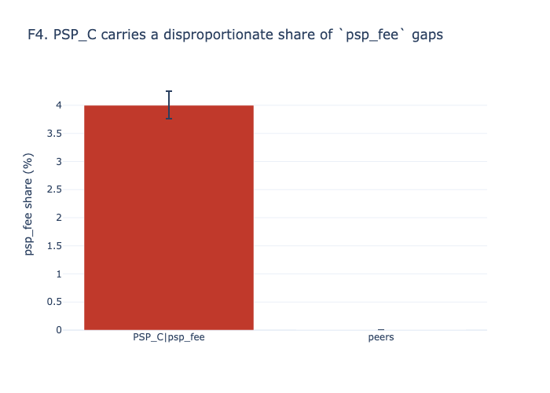
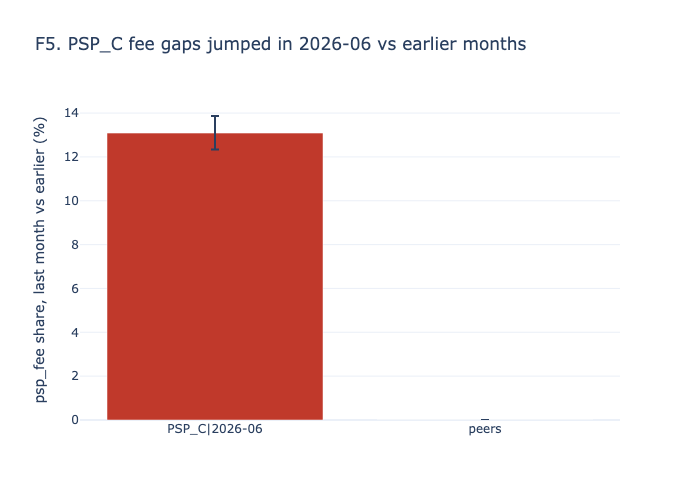
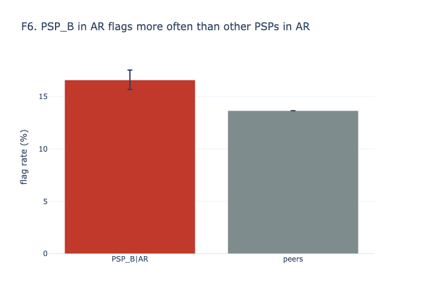
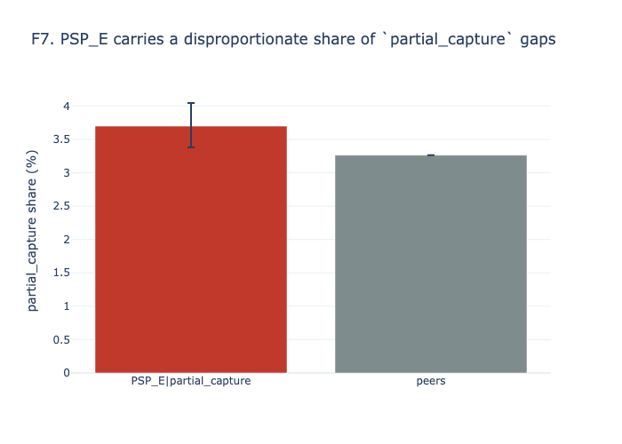
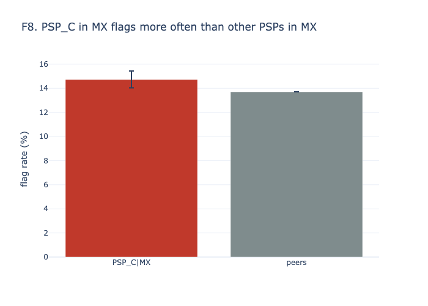
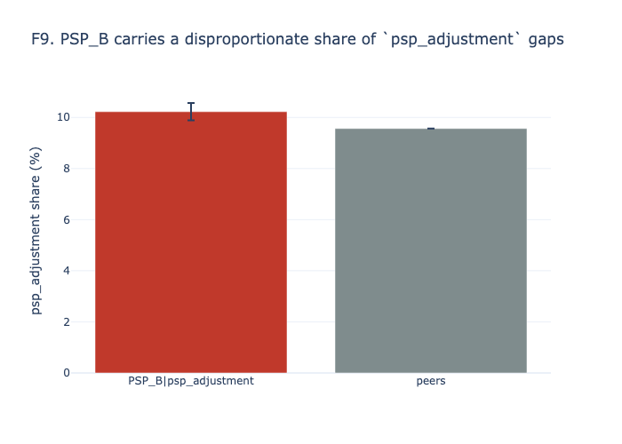
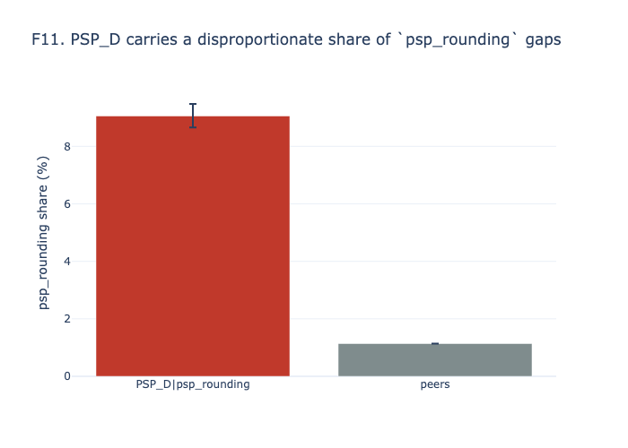
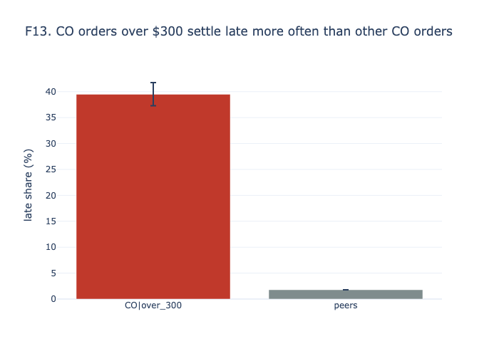

# Settlement discrepancy findings

_As of 2026-06-30T23:58:00 · data window 2026-04 to 2026-06 (3 months) · every number below is generated by `recon report` from `reports/findings.json` and `reports/analysis/*.csv`._

## Summary

- **Settled payments:** 124,389. **Flagged** (meaningful or large): 17,415 (14.0%); any non-exact gap: 32.9%. Synthetic data follows the brief's ranges; it does not claim to reproduce the CFO's figure.
- **Money:** gross under-settled $129,763, gross over-settled $345, net loss $129,418 for the quarter, compared with $127k (estimate; synthetic data).
- **Worst PSP week last month:** PSP_C, 2026-W23: net loss $2,934 on 1,923 payments (19.0% flagged).
- **Top findings:**
  - F1. Multi-item orders flag more often (partial captures): $33,298 per quarter.
  - F2. Weekend authorizations flag more often than weekday ones: $7,852 per quarter.
  - F3. High-risk orders flag more often (fraud holds): $5,431 per quarter.

**Where the money goes (cause Pareto)**

| likely_cause | n | gross_under_usd | gross_over_usd | net_usd | share_of_loss |
|---|---|---|---|---|---|
| partial_capture | 4,113 | $77,882 | $0 | $77,882 | 60.0% |
| psp_adjustment | 12,102 | $43,292 | $0 | $43,292 | 33.4% |
| fraud_hold | 811 | $6,289 | $0 | $6,289 | 4.8% |
| psp_fee | 987 | $1,524 | $0 | $1,524 | 1.2% |
| psp_rounding | 2,905 | $419 | $0 | $419 | 0.3% |
| tax_recalc | 595 | $359 | $345 | $14 | 0.3% |
| fx_timing | 19,473 | $0 | $0 | $0 | 0.0% |
| tip | 0 | $0 | $0 | $0 | 0.0% |
| unexplained | 0 | $0 | $0 | $0 | 0.0% |

## Findings

**F1. Multi-item orders flag more often (partial captures).** 17.3% flag rate on item_count >= 2 (n = 55,702, 95% CI [16.9–17.6%]) vs 11.4% for peers — lift 1.52×, q < 0.001. $ impact: $33,298 per quarter (25.7% of loss; median loss $5). Likely cause: `partial_capture`. Action: see R1.

**F2. Weekend authorizations flag more often than weekday ones.** 16.2% flag rate on weekend (n = 35,547, 95% CI [15.9–16.6%]) vs 13.1% for peers — lift 1.24×, q < 0.001. $ impact: $7,852 per quarter (6.1% of loss; median loss $4). Likely cause: `psp_adjustment`. Action: see RECOMMENDATIONS.md.

**F3. High-risk orders flag more often (fraud holds).** 33.1% flag rate on risk_score >= 0.8 (n = 3,553, 95% CI [31.5–34.6%]) vs 13.4% for peers — lift 2.46×, q < 0.001. $ impact: $5,431 per quarter (4.2% of loss; median loss $4). Likely cause: `fraud_hold`. Action: see R1.

**F4. PSP_C carries a disproportionate share of `psp_fee` gaps.** 4.0% psp_fee share on PSP_C|psp_fee (n = 24,678, 95% CI [3.8–4.3%]) vs 0.0% for peers — lift n/a, peers at 0, q < 0.001. $ impact: $1,524 per quarter (1.2% of loss; median loss $2). Likely cause: `psp_fee`. Action: see R2.

**F5. PSP_C fee gaps jumped in 2026-06 vs earlier months.** 13.1% psp_fee share, last month vs earlier on PSP_C|2026-06 (n = 7,542, 95% CI [12.3–13.9%]) vs 0.0% for peers — lift n/a, peers at 0, q < 0.001. $ impact: $1,524 per quarter (1.2% of loss; median loss $2). Likely cause: `psp_fee`. Action: see R2.

**F6. PSP_B in AR flags more often than other PSPs in AR.** 16.6% flag rate on PSP_B|AR (n = 6,168, 95% CI [15.7–17.5%]) vs 13.7% for peers — lift 1.21×, q < 0.001. $ impact: $1,154 per quarter (0.9% of loss; median loss $3). Likely cause: `psp_adjustment`. Action: see R3.

**F7. PSP_E carries a disproportionate share of `partial_capture` gaps.** 3.7% partial_capture share on PSP_E|partial_capture (n = 12,357, 95% CI [3.4–4.0%]) vs 3.3% for peers — lift 1.13×, q = 0.028. $ impact: $1,064 per quarter (0.8% of loss; median loss $10). Likely cause: `partial_capture`. Action: see RECOMMENDATIONS.md.

**F8. PSP_C in MX flags more often than other PSPs in MX.** 14.7% flag rate on PSP_C|MX (n = 9,849, 95% CI [14.0–15.4%]) vs 13.7% for peers — lift 1.07×, q = 0.025. $ impact: $789 per quarter (0.6% of loss; median loss $3). Likely cause: `psp_adjustment`. Action: see R4.

**F9. PSP_B carries a disproportionate share of `psp_adjustment` gaps.** 10.2% psp_adjustment share on PSP_B|psp_adjustment (n = 31,057, 95% CI [9.9–10.6%]) vs 9.6% for peers — lift 1.07×, q = 0.002. $ impact: $724 per quarter (0.6% of loss; median loss $2). Likely cause: `psp_adjustment`. Action: see R5.

**F10. PSP_C in CO flags more often than other PSPs in CO.** 15.0% flag rate on PSP_C|CO (n = 6,209, 95% CI [14.1–15.9%]) vs 13.3% for peers — lift 1.12×, q = 0.002. $ impact: $708 per quarter (0.5% of loss; median loss $3). Likely cause: `psp_adjustment`. Action: see RECOMMENDATIONS.md.

**F11. PSP_D carries a disproportionate share of `psp_rounding` gaps.** 9.1% psp_rounding share on PSP_D|psp_rounding (n = 18,812, 95% CI [8.7–9.5%]) vs 1.1% for peers — lift 7.96×, q < 0.001. $ impact: $366 per quarter (0.3% of loss; median loss $0). Likely cause: `psp_rounding`. Action: see RECOMMENDATIONS.md.

**F12. PSP_D in CL flags more often than other PSPs in CL.** 16.2% flag rate on PSP_D|CL (n = 2,864, 95% CI [14.9–17.6%]) vs 14.0% for peers — lift 1.16×, q = 0.005. $ impact: $301 per quarter (0.2% of loss; median loss $1). Likely cause: `psp_adjustment`. Action: see RECOMMENDATIONS.md.

**F13. CO orders over $300 settle late more often than other CO orders.** 39.5% late share on CO|over_300 (n = 1,843, 95% CI [37.3–41.8%]) vs 1.8% for peers — lift 22.10×, q < 0.001. $ impact: $0 per quarter (0.0% of loss; median loss $14; delay, not loss). Likely cause: `n/a`. Action: see RECOMMENDATIONS.md.

**Not significant** (worse than peers, but q ≥ 0.05): `psp_e_co_peer` (q = 0.139), `psp_a_fraud_hold` (q = 0.339), `cl_over_300_lag` (q = 0.453), `psp_c_cl_peer` (q = 0.453), `psp_b_co_peer` (q = 0.485), `psp_c_partial_capture` (q = 0.701), `psp_b_tax_recalc` (q = 0.772), `mx_over_300_lag` (q = 0.779), `psp_a_adjustment` (q = 0.779), `psp_a_co_peer` (q = 0.779).

## Answers to the brief's questions

All rates are over settled payments; a flag is a `meaningful` or `large` gap. Peers: the rest of the data, except PSP × country, which is compared with the other PSPs in the same country. `q` is the Benjamini-Hochberg adjusted p-value over every test below.

### Which countries and currencies have the highest rates?

| segment_type | segment_value | n | rate | ci_low | ci_high | peer_rate | lift | q | excess_usd |
|---|---|---|---|---|---|---|---|---|---|
| country | AR | 24,764 | 14.4% | 14.0% | 14.8% | 13.9% | 1.03 | 0.113 | $849 |
| country | CL | 18,660 | 14.3% | 13.8% | 14.8% | 13.9% | 1.03 | 0.339 | $476 |
| country | CO | 31,382 | 13.7% | 13.3% | 14.0% | 14.1% | 0.968 | 0.102 | $0 |
| country | MX | 49,583 | 13.9% | 13.6% | 14.2% | 14.1% | 0.989 | 0.556 | $0 |
| currency | ARS | 24,764 | 14.4% | 14.0% | 14.8% | 13.9% | 1.03 | 0.113 | $849 |
| currency | CLP | 18,660 | 14.3% | 13.8% | 14.8% | 13.9% | 1.03 | 0.339 | $476 |
| currency | COP | 31,382 | 13.7% | 13.3% | 14.0% | 14.1% | 0.968 | 0.102 | $0 |
| currency | MXN | 49,583 | 13.9% | 13.6% | 14.2% | 14.1% | 0.989 | 0.556 | $0 |

### Which PSPs are most problematic?

| segment_type | segment_value | n | rate | ci_low | ci_high | peer_rate | lift | q | excess_usd |
|---|---|---|---|---|---|---|---|---|---|
| psp_country | PSP_B|AR | 6,168 | 16.6% | 15.7% | 17.5% | 13.7% | 1.21 | < 0.001 | $1,154 |
| psp_country | PSP_C|MX | 9,849 | 14.7% | 14.0% | 15.4% | 13.7% | 1.07 | 0.025 | $789 |
| psp_country | PSP_C|CO | 6,209 | 15.0% | 14.1% | 15.9% | 13.3% | 1.12 | 0.002 | $708 |
| psp_country | PSP_D|CL | 2,864 | 16.2% | 14.9% | 17.6% | 14.0% | 1.16 | 0.005 | $301 |
| psp_country | PSP_E|CO | 3,121 | 14.7% | 13.5% | 16.0% | 13.5% | 1.09 | 0.139 | $299 |
| psp_country | PSP_B|CO | 7,858 | 14.0% | 13.2% | 14.8% | 13.5% | 1.03 | 0.485 | $255 |
| psp_country | PSP_C|CL | 3,664 | 14.9% | 13.8% | 16.1% | 14.2% | 1.05 | 0.453 | $176 |
| psp_country | PSP_A|CO | 9,556 | 13.8% | 13.1% | 14.5% | 13.6% | 1.01 | 0.779 | $132 |
| psp_country | PSP_A|MX | 14,958 | 14.0% | 13.4% | 14.5% | 13.9% | 1.01 | 0.918 | $80 |
| psp_country | PSP_D|MX | 7,546 | 14.0% | 13.2% | 14.8% | 13.9% | 1.01 | 0.958 | $43 |
| psp_country | PSP_D|AR | 3,764 | 14.5% | 13.4% | 15.6% | 14.4% | 1.01 | 0.984 | $25 |
| psp_country | PSP_A|AR | 7,452 | 13.1% | 12.3% | 13.9% | 14.9% | 0.876 | < 0.001 | $0 |
| psp_country | PSP_A|CL | 5,519 | 13.8% | 13.0% | 14.8% | 14.5% | 0.954 | 0.399 | $0 |
| psp_country | PSP_B|CL | 4,673 | 13.8% | 12.8% | 14.8% | 14.5% | 0.951 | 0.399 | $0 |
| psp_country | PSP_B|MX | 12,358 | 13.3% | 12.7% | 13.9% | 14.1% | 0.944 | 0.071 | $0 |
| psp_country | PSP_C|AR | 4,956 | 14.2% | 13.2% | 15.2% | 14.4% | 0.981 | 0.772 | $0 |
| psp_country | PSP_D|CO | 4,638 | 10.3% | 9.5% | 11.2% | 14.2% | 0.724 | < 0.001 | $0 |
| psp_country | PSP_E|AR | 2,424 | 13.1% | 11.8% | 14.5% | 14.5% | 0.903 | 0.137 | $0 |
| psp_country | PSP_E|CL | 1,940 | 13.1% | 11.7% | 14.7% | 14.5% | 0.906 | 0.217 | $0 |
| psp_country | PSP_E|MX | 4,872 | 13.5% | 12.6% | 14.5% | 13.9% | 0.968 | 0.556 | $0 |

### Does transaction size matter?

| segment_type | segment_value | n | rate | ci_low | ci_high | peer_rate | lift | q | excess_usd |
|---|---|---|---|---|---|---|---|---|---|
| amount_tier | 10-50 | 56,036 | 16.6% | 16.3% | 16.9% | 11.9% | 1.39 | < 0.001 | $9,628 |
| amount_tier | 200+ | 18,773 | 10.8% | 10.4% | 11.3% | 14.6% | 0.745 | < 0.001 | $0 |
| amount_tier | 50-200 | 49,580 | 12.3% | 12.0% | 12.6% | 15.1% | 0.813 | < 0.001 | $0 |
| size_vs_magnitude | spearman | 40,986 | -13.7% |  |  |  |  | < 0.001 |  |

### Are there time-based patterns?

| segment_type | segment_value | n | rate | ci_low | ci_high | peer_rate | lift | q | excess_usd |
|---|---|---|---|---|---|---|---|---|---|
| is_weekend | false | 88,842 | 13.1% | 12.9% | 13.3% | 16.2% | 0.808 | < 0.001 | $0 |
| is_weekend | true | 35,547 | 16.2% | 15.9% | 16.6% | 13.1% | 1.24 | < 0.001 | $7,852 |
| lag_bucket | 2-3 | 64,982 | 13.9% | 13.6% | 14.2% | 14.1% | 0.987 | 0.527 | $0 |
| lag_bucket | 4-5 | 31,909 | 14.2% | 13.8% | 14.6% | 13.9% | 1.02 | 0.408 | $606 |
| lag_bucket | 6-7 | 4,663 | 13.6% | 12.6% | 14.6% | 14.0% | 0.97 | 0.556 | $0 |
| lag_bucket | 8+ | 2,647 | 13.1% | 11.9% | 14.4% | 14.0% | 0.935 | 0.339 | $0 |
| lag_bucket | ≤1 | 20,188 | 14.2% | 13.7% | 14.7% | 14.0% | 1.02 | 0.556 | $330 |
| lag_over_300 | AR|over_300 | 1,379 | 1.5% | 1.0% | 2.3% | 1.9% | 0.819 | 0.453 | $0 |
| lag_over_300 | CL|over_300 | 1,150 | 2.2% | 1.5% | 3.2% | 2.0% | 1.09 | 0.453 | $0 |
| lag_over_300 | CO|over_300 | 1,843 | 39.5% | 37.3% | 41.8% | 1.8% | 22.1 | < 0.001 | $0 |
| lag_over_300 | MX|over_300 | 3,143 | 1.7% | 1.3% | 2.2% | 1.7% | 1.01 | 0.779 | $0 |

### Systematic issues: which PSP carries each cause?

| segment_type | segment_value | n | rate | ci_low | ci_high | peer_rate | lift | q | excess_usd |
|---|---|---|---|---|---|---|---|---|---|
| cause_psp | PSP_C|psp_fee | 24,678 | 4.0% | 3.8% | 4.3% | 0.0% |  | < 0.001 | $1,524 |
| cause_psp | PSP_E|partial_capture | 12,357 | 3.7% | 3.4% | 4.0% | 3.3% | 1.13 | 0.028 | $1,064 |
| cause_psp | PSP_B|psp_adjustment | 31,057 | 10.2% | 9.9% | 10.6% | 9.6% | 1.07 | 0.002 | $724 |
| cause_psp | PSP_D|psp_rounding | 18,812 | 9.1% | 8.7% | 9.5% | 1.1% | 7.96 | < 0.001 | $366 |
| cause_psp | PSP_C|partial_capture | 24,678 | 3.4% | 3.1% | 3.6% | 3.3% | 1.02 | 0.701 | $361 |
| cause_psp | PSP_A|fraud_hold | 37,485 | 0.7% | 0.6% | 0.8% | 0.6% | 1.11 | 0.339 | $196 |
| cause_psp | PSP_A|psp_adjustment | 37,485 | 9.8% | 9.5% | 10.1% | 9.7% | 1.01 | 0.779 | $104 |
| cause_psp | PSP_B|fraud_hold | 31,057 | 0.7% | 0.6% | 0.8% | 0.6% | 1.04 | 0.779 | $58 |
| cause_psp | PSP_B|partial_capture | 31,057 | 3.3% | 3.1% | 3.5% | 3.3% | 1 | 1.000 | $55 |
| cause_psp | PSP_C|psp_adjustment | 24,678 | 9.7% | 9.4% | 10.1% | 9.7% | 1 | 1.000 | $0 |

### Other drivers

| segment_type | segment_value | n | rate | ci_low | ci_high | peer_rate | lift | q | excess_usd |
|---|---|---|---|---|---|---|---|---|---|
| item_count | item_count >= 2 | 55,702 | 17.3% | 16.9% | 17.6% | 11.4% | 1.52 | < 0.001 | $33,298 |
| risk_score | risk_score >= 0.8 | 3,553 | 33.1% | 31.5% | 34.6% | 13.4% | 2.46 | < 0.001 | $5,431 |
| fee_drift | PSP_C|2026-06 | 7,542 | 13.1% | 12.3% | 13.9% | 0.0% |  | < 0.001 | $1,524 |
| cross_border | false | 99,342 | 14.0% | 13.8% | 14.3% | 13.8% | 1.01 | 0.556 | $1,428 |
| cross_border | true | 25,047 | 13.8% | 13.4% | 14.3% | 14.0% | 0.986 | 0.556 | $0 |
| fee_drift | PSP_A|2026-06 | 11,266 | 0.0% | 0.0% | 0.0% | 0.0% |  | 1.000 | $0 |
| fee_drift | PSP_B|2026-06 | 9,382 | 0.0% | 0.0% | 0.0% | 0.0% |  | 1.000 | $0 |
| fee_drift | PSP_D|2026-06 | 5,702 | 0.0% | 0.0% | 0.1% | 0.0% |  | 1.000 | $0 |
| fee_drift | PSP_E|2026-06 | 3,726 | 0.0% | 0.0% | 0.1% | 0.0% |  | 1.000 | $0 |

## Model check

One logistic GLM: flag ~ PSP × country + amount tier + cross-border + weekend + lag bucket. Top 10 terms by p-value (odds ratios, 95% CI). Lag is also an outcome, so its coefficient is a link, not a cause.

| term | odds_ratio | or_ci_low | or_ci_high | p |
|---|---|---|---|---|
| C(psp)[T.PSP_B] | 1.32 | 1.2 | 1.46 | < 0.001 |
| C(amount_tier)[T.200+] | 0.611 | 0.58 | 0.643 | < 0.001 |
| C(amount_tier)[T.50-200] | 0.705 | 0.68 | 0.73 | < 0.001 |
| C(psp)[T.PSP_D]:C(country)[T.CO] | 0.639 | 0.545 | 0.75 | < 0.001 |
| C(psp)[T.PSP_B]:C(country)[T.MX] | 0.714 | 0.634 | 0.803 | < 0.001 |
| is_weekend | 1.29 | 1.25 | 1.34 | < 0.001 |
| C(psp)[T.PSP_B]:C(country)[T.CO] | 0.772 | 0.679 | 0.878 | < 0.001 |
| C(psp)[T.PSP_B]:C(country)[T.CL] | 0.755 | 0.651 | 0.875 | < 0.001 |
| C(psp)[T.PSP_D] | 1.12 | 1 | 1.26 | 0.048 |
| C(country)[T.MX] | 1.08 | 0.997 | 1.17 | 0.058 |

No terms dropped.

## Systematic vs random

Signatures (PSP × country × cause × direction × rounding flag), top 10 by $. `systematic` = enough rows and a PSP that holds far more of that cause than its share of the country's volume.

| psp | country | likely_cause | direction | n | concentration | usd | label |
|---|---|---|---|---|---|---|---|
| PSP_B | MX | partial_capture | under | 410 | 1 | $8,943 | random |
| PSP_A | MX | partial_capture | under | 485 | 0.98 | $8,426 | random |
| PSP_C | MX | partial_capture | under | 336 | 1.03 | $7,062 | random |
| PSP_A | CO | partial_capture | under | 309 | 0.997 | $5,637 | random |
| PSP_A | MX | psp_adjustment | under | 1,496 | 1.03 | $5,388 | random |
| PSP_D | MX | partial_capture | under | 247 | 0.99 | $4,931 | random |
| PSP_B | CO | partial_capture | under | 254 | 0.996 | $4,643 | random |
| PSP_A | AR | partial_capture | under | 237 | 0.933 | $4,595 | random |
| PSP_B | MX | psp_adjustment | under | 1,160 | 0.964 | $4,074 | random |
| PSP_C | CO | partial_capture | under | 205 | 1.02 | $3,747 | random |

## Cause labels vs truth

| cause | n_pred | n_true | precision | recall |
|---|---|---|---|---|
| fraud_hold | 811 | 811 | 100.0% | 100.0% |
| fx_timing | 19,473 | 19,622 | 100.0% | 99.2% |
| partial_capture | 4,113 | 4,113 | 100.0% | 100.0% |
| psp_adjustment | 12,102 | 12,102 | 100.0% | 100.0% |
| psp_fee | 987 | 987 | 100.0% | 100.0% |
| psp_rounding | 2,905 | 2,756 | 94.9% | 100.0% |
| tax_recalc | 595 | 595 | 100.0% | 100.0% |

Lowest precision or recall: 94.9%.
tip: ruled out (0 rows). Unexplained rows: 0.

## Sensitivity

Flag rate if the `meaningful` cut-off moved (the $ cut-off always applies):

| cut_pct | n | n_flagged | rate |
|---|---|---|---|
| 1 | 124,389 | 18,267 | 14.7% |
| 2 | 124,389 | 17,415 | 14.0% |
| 3 | 124,389 | 13,336 | 10.7% |

## Latest alerts

- SEV2: 3
- SEV3: 3

- **SEV2** peer PSP_B|AR: PSP_B flags 18.1% of AR rows vs 14.5% for other PSPs (+3.6 pts, q < 0.001; 95% CI 16.4%-19.8%). (owner: PSP ops)
- **SEV2** peer PSP_C|CO: PSP_C flags 17.0% of CO rows vs 12.6% for other PSPs (+4.4 pts, q < 0.001; 95% CI 15.4%-18.7%). (owner: PSP ops)
- **SEV2** peer PSP_C|MX: PSP_C flags 17.3% of MX rows vs 13.5% for other PSPs (+3.8 pts, q < 0.001; 95% CI 16.1%-18.7%). (owner: PSP ops)
- **SEV3** change PSP_C|CO: Resolved: PSP_C|CO flag rate 19.0% in 2026-W24 is above the control limit 18.7% (baseline 14.1%). (owner: PSP ops)
- **SEV3** large_rows ALL: 379 large rows ($6,341.13 absolute) in 2026-W25; top: PSP_B|MX $723.66, PSP_A|MX $602.30, PSP_C|MX $498.40. (owner: PSP ops)
- **SEV3** settle_lag CO|200+: 17.5% of CO|200+ rows settle after 7 days (limit 6.0%). (owner: PSP ops)

## Method notes

Definitions (categories, FX-adjusted residual, peer rule, worst week) are in the README. Rates use Wilson intervals; rate tests use chi-square, or Fisher when a cell is small; lag uses a one-sided Mann-Whitney test. $ impact per finding = (segment rate − peer rate) × segment volume × mean loss per flagged payment, never negative; the window is one quarter. Recommendations and their savings are in RECOMMENDATIONS.md.
