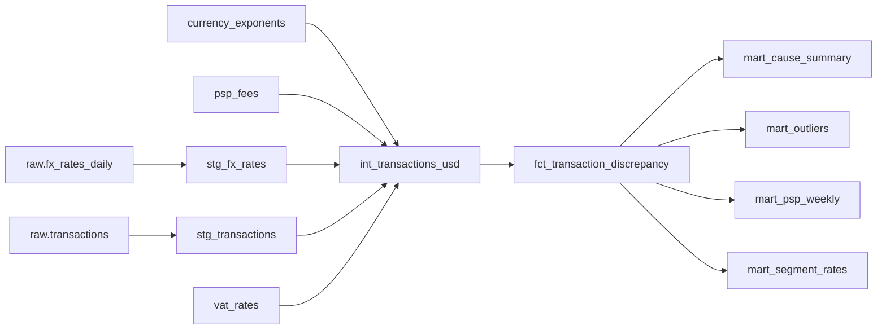

# dbt lineage

Generated by `recon ops lineage` from dbt `manifest.json`.
Full docs site: `data/.dbt/lineage/target` (serve it with `python -m http.server` from that folder).

| Model | Layer | Materialized | Parents | Upstream sources / seeds |
|---|---|---|---|---|
| `int_transactions_usd` | intermediate | incremental | currency_exponents, psp_fees, stg_fx_rates, stg_transactions, vat_rates | currency_exponents, psp_fees, raw.fx_rates_daily, raw.transactions, vat_rates |
| `fct_transaction_discrepancy` | marts | incremental | int_transactions_usd | currency_exponents, psp_fees, raw.fx_rates_daily, raw.transactions, vat_rates |
| `mart_cause_summary` | marts | table | fct_transaction_discrepancy | currency_exponents, psp_fees, raw.fx_rates_daily, raw.transactions, vat_rates |
| `mart_outliers` | marts | table | fct_transaction_discrepancy | currency_exponents, psp_fees, raw.fx_rates_daily, raw.transactions, vat_rates |
| `mart_psp_weekly` | marts | table | fct_transaction_discrepancy | currency_exponents, psp_fees, raw.fx_rates_daily, raw.transactions, vat_rates |
| `mart_segment_rates` | marts | table | fct_transaction_discrepancy | currency_exponents, psp_fees, raw.fx_rates_daily, raw.transactions, vat_rates |
| `stg_fx_rates` | staging | table | raw.fx_rates_daily | raw.fx_rates_daily |
| `stg_transactions` | staging | table | raw.transactions | raw.transactions |

